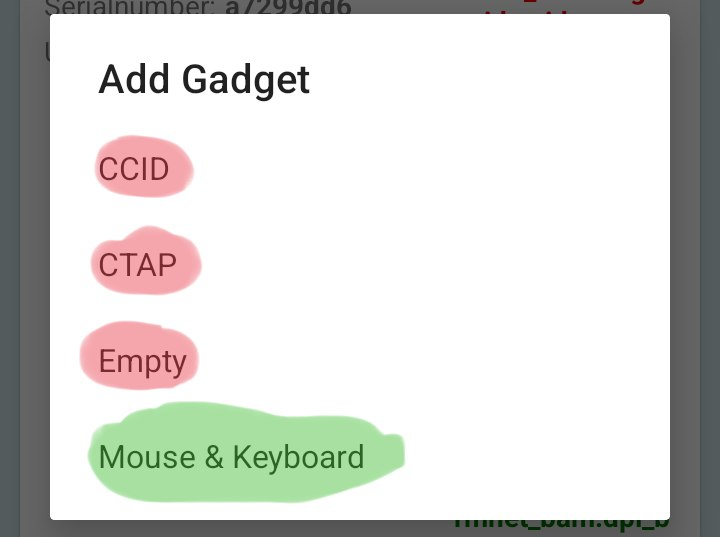
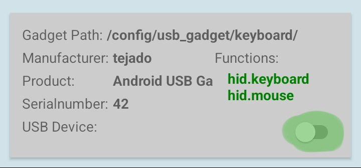

# ◐ &nbsp; BadUSB-Payloads-and-Tutorials &nbsp; ◑

**BadUSB Payloads & Tutorials: Powerful HID attack, step-by-step guide.**

## Briefly about the repository, and what we will do
Here I will tell you how to turn your smartphone into a tool that can carry out HID Attacks. Simply put - BadUSB from your phone

## 🧰 What you need 🧰
1. Rooted smartphone
2. The kernel on the phone that supports ConfigFS
3. Straight arms

## 🛠️ Installation and setup USB Gadget Tool🛠️
1. Download and install "USB Gadget Tool_0.4.apk" from BadUSB/APK`s
2. Open USB Gadget Tool
3. Follow the pictures
4. 
Click on "+"
6. 
Click on "Mouse & Keyboard"
8. 
Click on slider [ON]
10. Congrats! You have set up a simulated smartphone as a HID Device

## 🐤 Installation and setup Rubber Ducky 🐤🛠
1. Download and install "rucky+2.3.apk" from BadUSB/APK`s
2. Open Rucky.
3. Grant it SU - [Superuser] mode.
4. Congrats! Now you can use your phone as a HID attack tool.
